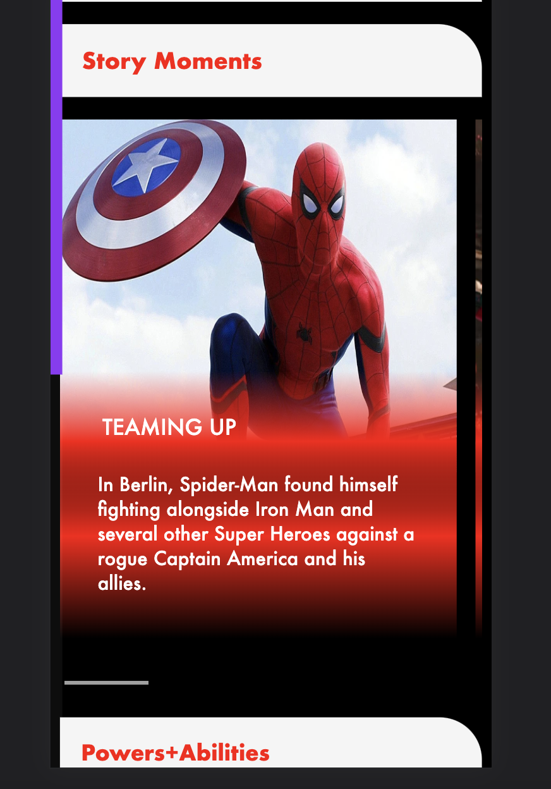

# Procesverslag
Markdown is een simpele manier om HTML te schrijven.  
Markdown cheat cheet: [Hulp bij het schrijven van Markdown](https://github.com/adam-p/markdown-here/wiki/Markdown-Cheatsheet).

Nb. De standaardstructuur en de spartaanse opmaak van de README.md zijn helemaal prima. Het gaat om de inhoud van je procesverslag. Besteedt de tijd voor pracht en praal aan je website.

Nb. Door *open* toe te voegen aan een *details* element kun je deze standaard open zetten. Fijn om dat steeds voor de relevante stuk(ken) te doen.

## Jij

  
uitwerken voor kick-off werkgroep

  ### Auteur:
  Ryan de Vries

  #### Je startniveau:
  Rood

  #### Je focus:
  surface plane
 

## Je website

  
uitwerken voor kick-off werkgroep

  ### Je opdracht:
  (https://www.marvel.com/)

  #### Screenshot(s) van de eerste pagina (small screen): 
  Home  
  
  
  
  
  

  #### Screenshot(s) van de tweede pagina (small screen):
  Spider-man onscreen report 
  
  
  
  
 

## Toegankelijkheidstest 1/2 (week 1)

  
uitwerken na test in 1e werkgroep

  ### Bevindingen
  Lijst met je bevindingen die in de test naar voren kwamen:

  #### Screenreader
  Hier korte omschrijving (met indien nodig afbeeldingen)
De screenreader las gelijk de complete pagina voor. Je merkte geen verschil tussen headings en knoppen met links. De nav bar werdt niet voorgelezen.
  
  
  Hier een omschrijving van hoe het opgelost kan worden (met indien nodig afbeeldingen)
Verschil creëren zodat je weet wanneer je een link hebt. Dingen zoals de nav bar wat meer naar voor brengen.
  

  #### Muis en Toetsenbord 
  Hier korte omschrijving (met indien nodig afbeeldingen)
  
  Je kon lang niet door alles heen navigeren de toetsenbord manier slaat knoppen over die je wel kan zien. Ook is er geen duidelijke aanwijzing van waar je focus zit en op welk blokje je bent.

  Hier een omschrijving van hoe het opgelost kan worden (met indien nodig afbeeldingen)
  
  een duidelijke focus state te maken zodat je weet waar je bent en er moet de mogelijk heid komen om ook over alle knoppen heen te kunnnen navigeren

  #### Motoriek (shocks, elastiekjes)
  Met elastiekjes en dus minder makkelijk te gebruiken vingers is het wel te doen het is alleen lastig te gebruiken als je je telefoon in de zelfde hand houdt.
  
  De Shocks in je armen zijn erg irritant je begint hierdoor erg te bewegen hierdoor is het scherm lastig te lezen. 
  
  de ballon hooghoudt oefening is wel irritant om dan te focussen waar je was gebleven met lezen in een langere tekst, zeker met kleinere letters in grotere stukken tekst.

  Hier een omschrijving van hoe het opgelost kan worden (met indien nodig afbeeldingen)

  Lastig op te lossen via de site. Een screenreader helpt al met het voorlezen tegen het shacken, Grotere leters en knoppen kunnen het makkelijker maken om iets te lezen en of gebruiken.
  
  je zou het focus probleem kunnen oplossen doormiddel van disclosive progression. Grotere letters maakt het makelijker terug vinden. En bijvoorbeeld prikkels die de aandacht lokken naar het scherm. Bijvoorbeeld bewegingen.
  
  
  #### Visueel (brillen, contrast, kleurenblind, dark/light). 
  Hier korte omschrijving (met indien nodig afbeeldingen)

  met bril getest dat het wazig werd er ontstond een soort glow waardoor felle kleuren nog feller werden en de wegvielen tegen het wit.
  
  Kleurenblind merkte je niet veel tegenslag de site is wel minder vrolijk aan kleuren.
  
  stip in het midden is de tekst amper tot niet te lezen
  
  Hier een omschrijving van hoe het opgelost kan worden (met indien nodig afbeeldingen).
  

  Beter contrast bij de tekst in kleur. 
  
  Grotere letters
  

## Breakdownschets (week 1)

  
uitwerken na afloop 2e werkgroep

  ### de hele pagina: 
  

  ### dynamisch deel (bijv menu): 
  

## Voortgang 1 (week 2)

  
uitwerken voor 1e voortgang

  ### Stand van zaken
  hier dit ging goed & dit was lastig (neem ook screenshots op van delen van je website en code)
  
  Het was voor mij lastig om niet naar de html te kijken van de site die ik namaak. Ik wil te graag dan precies het zelfde doen wat echt alles behalve       goed is. Waardoor ik zo laat opgang kwam van het schrijven van mijn site. Verder heb ik niet echt dingen waar ik tegen aan liep. Ik kom tot nu toe goed door de code heen met wat ik wil maken. Soms ik moet wel even wat extra opdrachten bij gaan maken van positionering zodat me dat ook wat makkelijker afgaan. Ik heb voor de eerste voortgang al wat geleerd van onderandere de linear-gradient en grid.

  
   

  ### Agenda voor meeting
  samen met je groepje opstellen

  | student 1      | student 2            | student 3    | student 4        |
  | Bente          | Ryan                 | Lisa         | Tijn             |
  | HTML accesible | Voortgang            | voortgang    | Javascript.      |
  | Maken.         | Relatief en Absoluut | nog een punt |                  |
  |                |                      |              |                  |

  ### Verslag van meeting
  hier na afloop snel de uitkomsten van de meeting vastleggen

  - Ik had nog wel nesting fouten er in staan
  - Probleem met relatief en absolute opgelost
  - Lig wat achter en moet even een inhaal spurt gaan maken
  - ...

## Voortgang 2 (week 3)

  
uitwerken voor 2e voortgang

  ### Stand van zaken
  hier dit ging goed & dit was lastig (neem ook screenshots op van delen van je website en code)

  Het was een drukke week omdat ik al wat achter lag ik heb met behulp van een instructie video de animatie bovenin op de eerste webpage gemaakt. Verder had ik veel moeite met de linear gradient aan de praat te krijgen maar dat is uiteindelijk gelukt

 
  

  ### Agenda voor meeting
  samen met je groepje opstellen

  | student 1      | student 2          | student 3    | student 4        |
  | Bente          | Ryan               | Lisa         | Tijn             |
  | Responsive     | Voortgang          | voortgang    | probleem bij grid|
  | en dat ook nog |                    | nog een punt | dit wil ik zeker |
  | ...            | ...                | ...          | ...              |

  ### Verslag van meeting
  hier na afloop snel de uitkomsten van de meeting vastleggen

  - lig nu beter op schema maar nog wel een beetje achter
  - animatie ziet er goed uit
  - nog een punt
- ...

## Toegankelijkheidstest 2/2 (week 4)

  
uitwerken na test in 8e werkgroep

  ### Bevindingen
  Lijst met je bevindingen die in de test naar voren kwamen (geef ook aan wat er verbeterd is):

  #### Screenreader
  Hier korte omschrijving (met indien nodig afbeeldingen)

  leest nu niet alles in 1 keer voor

  Het is nu beter ingedeeld met de headings

  Afbeelding schuiven door maar de screenreader blijft hangen waardoor het lastig volgen word waar je bent.

  en de alternatieve tekst bij de images moet ik er nog uit halen anders leest hij alles nog voor en word het taai om doorheen te komen

  Hier een omschrijving van hoe het opgelost kan worden (met indien nodig afbeeldingen)

  Focus-within state en focus visible states kunnen dit probleem voorkomen

  #### Muis en Toetsenbord 
  Hier korte omschrijving (met indien nodig afbeeldingen)

  Het is nu beter te navigeren van punt naar punt en je hebt een duidelijker gevoel van waar je je zelf bevindt op de pagina. Doordat er een duidelijk focus state nu is.

  Hier een omschrijving van hoe het opgelost kan worden (met indien nodig afbeeldingen)

  De focus state van het menu komt niet naar voren waardoor je onzichtbaar door het menu heen moet klikken

  #### Motoriek (shocks, elastiekjes)
  Hier korte omschrijving (met indien nodig afbeeldingen)
  de knoppen zijn nog wel wat klein bij motorieke problemen als parkinson

  de site is goed te bedien bij bijvoorbeeld 1 of 2 vingers op een hand alleen hangt het dan wel er van af wel vingers het zijn, maar anders word je mobiel helemaal lastig te bedienen

  bij snelle afleiding helpt op de main page de constante bewegende img wheel

  Hier een omschrijving van hoe het opgelost kan worden (met indien nodig afbeeldingen)

  De knoppen kunnen groter gemaakt worden dan is het voor mensen met bijvoorbeeld parkinson makelijker te bedienen alleen wordt het qua looks voor de andere gebruikers minder mooi

  #### Visueel (brillen, contrast, kleurenblind, dark/light). 
  Hier korte omschrijving (met indien nodig afbeeldingen)

  Bij de kleurenfilters waren er geen probleem er blijft altijd een goed contrast tussen de teksten

  Bij blurred vision zijn de letters nog wel redelijk klein en dus lasig leesbaar

  met brillen waar het midden een beetje af gedekt worden is het nog goed te bedienen aangezien veel van de tekst aan de zijkanten bevinden en dat maakt het nog bereikbaar.

  Dat is dus wel wat minder bij afgedekte zijkanten maar dat is met de hand van de slider ook nog optelossen

  Hier een omschrijving van hoe het opgelost kan worden (met indien nodig afbeeldingen)

  Letters kunnen groter gemaakt worden voor de blurred vision 

  verder zou je voor mensen met slecht zichtbaar ogen voor zijkant of midden een knop kunnen maken om de tekst plaatsing aan te passen

## Voortgang 3 (week 4)

  
uitwerken voor 3e voortgang

  ### Stand van zaken
  hier dit ging goed & dit was lastig (neem ook screenshots op van delen van je website en code)

  Ik zat redelijk lekker in de flow, ik loop voor me gevoel wel een beetje achter zeker odat ik me meer op de mooiere dingen heb gefocust in het begin. Dus mis nu typografie en menubar nog. Voor me gevoel is het allemaal nog wel op te vangen en gaat het wel goed komen.

  
   

  ### Agenda voor meeting
  samen met je groepje opstellen

  | student 1        | student 2           | student 3     | student 4        |
  | Bente            | Ryan                | Lisa          | Tijn             |
  | Voortgang        | Voortgang           | Focus within  | en dan ik dat    |
  | en dat ook nog   | dit als er tijd is  | nog een punt  | dit wil ik zeker |
  | ...              | ...                 | ...           | ...              |

  ### Verslag van meeting
  hier na afloop snel de uitkomsten van de meeting vastleggen

  - Focus within en visible werd nog een keertje uitgelegd
  - Ik moet mijn BR eruit halen en door css styling vervangen
  - nog een punt
  - ...

## Eindgesprek (week 5)

  
uitwerken voor eindgesprek

  ### Je uitkomst - karakteristiek screenshots:
  
  
  

  ### Dit ging goed/Heb ik geleerd: 
  Korte omschrijving met plaatjes

  Ik heb veel geleerd over de positionering van img door absolute en fixed en relative. Ook heb ik veel geleerd over de gradient en een andere manier van keyframes te gebruiken.

  De css styling ging wel erg goed met margin en padding en em en dergelijke 

  ook ben ik blij met mijn menu bar

  De progressie scrollbar heb ik veel van geleerd maar vond ik wel moeielijker om te maken

  
  
  

  ### Dit was lastig/Is niet gelukt:
  Korte omschrijving met plaatjes

  Ik vond het lastig om met veel verschillende selectoren te gebruiken ook had ik moeite met de focus states voornamelijk om bij de img wheel 1 plaatje vast te houden dat is me ook niet gelukt uiteindelijk.

  

## Bronnenlijst

  
continu bijhouden terwijl je werkt

  Nb. Wees specifiek ('css-tricks' als bron is bijv. niet specifiek genoeg).

  1. https://www.youtube.com/watch?v=qDww4CbxtD4
  2. https://www.youtube.com/watch?v=qYFkQa0Bbq0
  3. dlo fixed button menu opdracht

